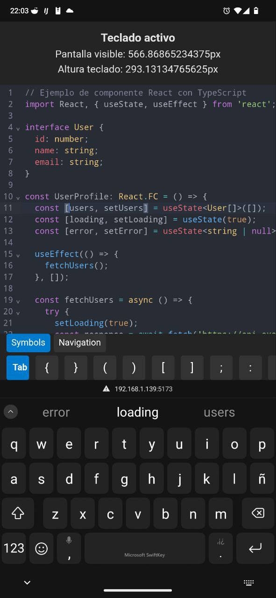

# Test Code Editor Mobile

## Libraries
- React
- CodeMirror

## Clone and Run
```
git clone https://github.com/StrongCod3r/test-code-editor-mobile.git
cd test-code-editor-mobile
pnpm i
pnpm run dev
```

## Preview


